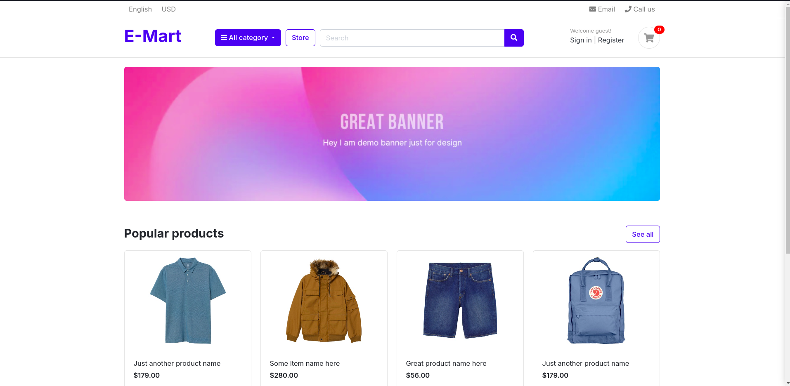

### Project screenshots

### using the project

- download/clone the source code
- navigate to the e-mart folder within a terminal/command line and type `python -m venv venv` to create a virtual environment. Or use the appropriate command to create a virtual environment
- activate the virtual environment e.g `source bin/activate`
- install the packages by running `pip install -r requirements.txt`
- create a postgres database
- create an .env file and specify the following values `DB_NAME_EMART, DB_USER, DB_USER_PASSWORD`
